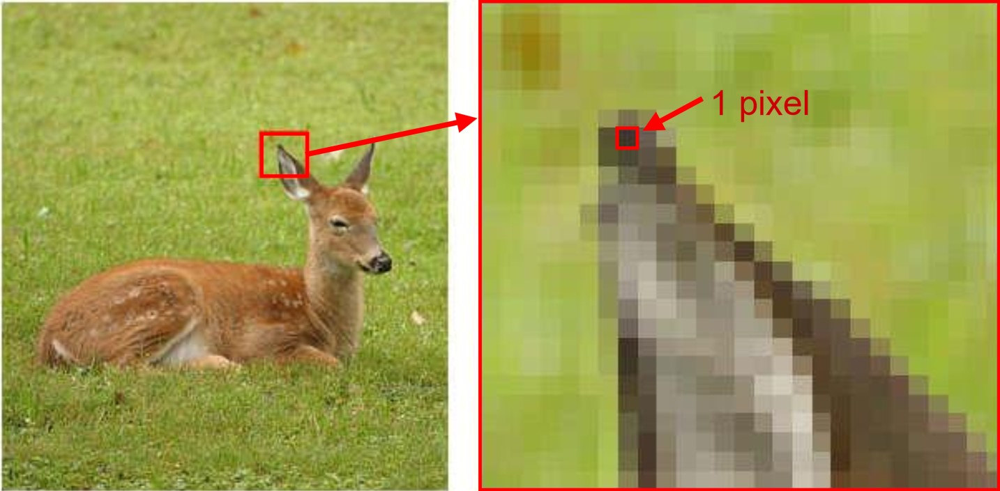
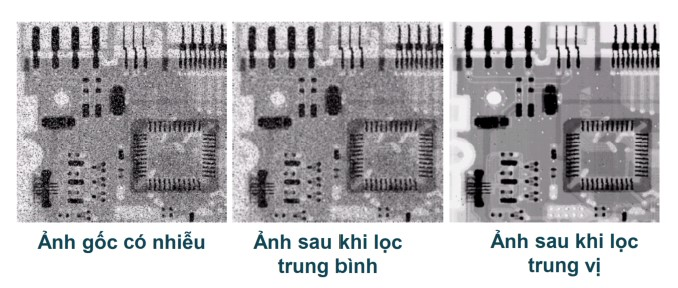
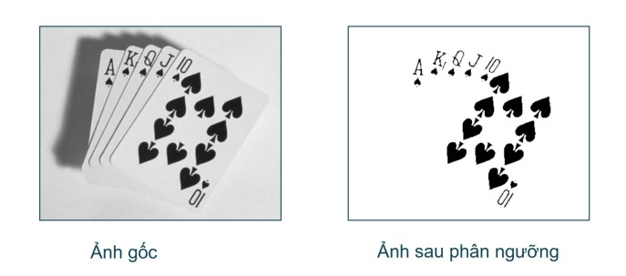

# Computer Vision

## OpenCV

### Thư viện ```cv2```

**Cài đặt:** gõ lệnh để tải xuống thư viện cv2 trong terminal. Lệnh:
```
python -m pit install opencv-python
```

**Kiểm tra version:**
```
python -m pip show opencv-python
```

=> Kết quả:
```
Name: opencv-python
Version: 4.13.0.90
```

## XỬ LÝ ẢNH SỐ

### Giới thiệu 

#### I. Ảnh số là gì?

Một bức ảnh được định nghĩa là 1 hàm 2 chiều, f(x,y), trong đó x, y là tọa độ không gian (spatial coordinates). f dùng để định nghĩa cho **cường độ ánh sáng** hay ***mức xám*** (gray level) của ảnh tại tọa độ (x,y).

- Khi x, y và f là những giá trị ***hữu hạn*** và ***rời rạc*** thì bức ảnh đó được gọi là **ảnh số**.

- Trong đó tọa độ (x,y) gọi là ***phần tử ảnh*** hoặc gọi là **pixel**.

- Giá trị pixel thường hiển thị mức xám, màu sắc, độ cao,...



*Ví dụ về 1 pixel*

**Chú ý:** ***số hóa*** nhấn mạnh rằng ảnh số là ***xấp xỉ*** (gần giống) của ảnh thực.

Các định dạng ảnh phổ biến bao gồm:

    - 1 mẫu trên 1 điểm (B&W or Grayscale)

    - 3 mẫu trên 1 điểm (Red, Green and Blue | RGB)

#### II. Xử lý ảnh số?

Đây là quá trình có đầu vào và đầu ra là ***ảnh***. Quá trình này có thể bao gồm: tách các thuộc tính của ảnh, nhận dạng ảnh,.... Xử lý ảnh số sẽ ***tập trung*** vào 2 nhiệm vụ chính sau:

1. Cải thiện thông tin ảnh để tăng khả năng cảm nhận cho mắt người.

2. Xử lý ảnh để lưu trữ, truyền và hiển thị cho phù hợp với tri giác của máy móc.

Có 3 cấp độ xử lý ảnh số, gồm: 
| Xử lý mức thấp | Xử lý mức trung | Xử lý mức cao     |
|----------------|-----------------|-------------------|
| input: ảnh     | input: ảnh      | input: thuộc tính |
| output: ảnh    | output: Thuộc tính (biên, đường viền,...) | output: Hiểu ảnh|
| làm sạch ảnh chứa một số ký tự | tách (phân đoạn) văn bản khỏi nền và nhận dạng các ký tự lẻ | hiểu nội dung văn bản |
|  |  |  |
